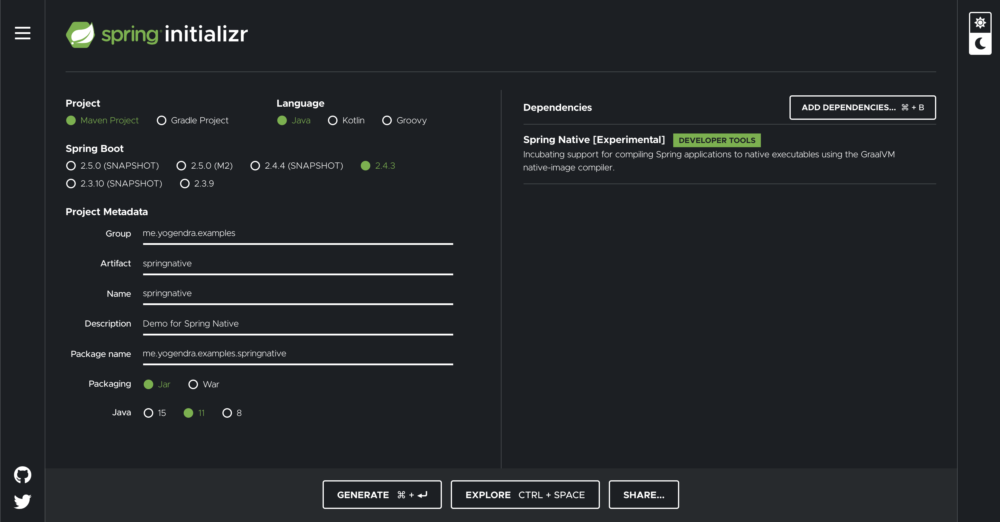

## Spring Native Workshop


-   [Spring Native is Beta](https://spring.io/blog/2021/03/11/announcing-spring-native-beta)
-   [Slide Deck](spring-native.pdf)
    <object data="spring-native.pdf" type="application/pdf" width="700px" height="700px">
        <embed src="spring-native.pdf">
            <p>This browser does not support PDFs. Please download the PDF to view it: <a href="spring-native.pdf">Download PDF</a>.</p>
        </embed>
    </object>


## Prerequisites

-   Linux or Windows environment 
    -   Native Images creation are not supported on Mac OS yet
    -   You can use Docker contianers on Mac, if you know what you are doing 
        ```
        docker container run  --name graalvm-workspace --rm -it -v $PWD:/app yogendra/graalvm-workspace:latest
        ```
        -   There is no git on this image, you can use curl to download the repo as an archive instead

            ```
            curl -L https://github.com/yogendra/spring-native-workshop/archive/main.tar.gz -o spring-native-workshop.tgz
            tar -xzvf spring-native-workshop.tar.gz
            mv spring-native-workshop-main spring-native-workshop
            cd spring-native-workshop
            ```

-   [GraalVM](https://github.com/graalvm/graalvm-ce-builds)
    ```
    > java -version
    openjdk version "11.0.10" 2021-01-19
    OpenJDK Runtime Environment GraalVM CE 21.0.0.2 (build 11.0.10+8-jvmci-21.0-b06)
    OpenJDK 64-Bit Server VM GraalVM CE 21.0.0.2 (build 11.0.10+8-jvmci-21.0-b06, mixed mode, sharing)
    ```
-   JAVA_HOME point to GraalVM
    - MacOS: export JAVA_HOME=/path/to/graalvm/Contents/Home
    - Windows: set JAVA_HOME=c:\path\to\graalvm
    - Linux: export JAVA_HOME=/path/to/graalvm
-   PATH variable contains GraalVM bin folder
    - MacOS: export PATH=$JAVA_HOME/bin:$PATH
    - Windows: set JAVA_HOME=%JAVA_HOME%\bin;%PATH$
    - Linux: export JAVA_HOME=$JAVA_HOME/bin:$PATH   
-   [GraalVM Native Image](https://docs.spring.io/spring-native/docs/current/reference/htmlsingle/#getting-started-native-image)
    ```
    > gu install native-image
    ```
-   Clone this repository
    ```
    git clone http://github.com/yogendra/spring-native-workshop.git spring-native-workshop
    ```
-   Apache Maven 3.x

## GraalVM Examples

[Source: GraalVM Documentation](https://www.graalvm.org/examples/java-performance-examples/)

### Simple upper case counter

**Directory:** examples/CountUppercase

 -  Lets compile it first

    ```
    javac -d out CountUppercase.java
    ```

-   This produced `CountUppercase.class` in same directory. We can run this using following command.

    ```
    java -cp out CountUppercase
    ```
    **Output**:
    ```
    1 (380 ms)
    2 (288 ms)
    3 (243 ms)
    4 (260 ms)
    5 (285 ms)
    6 (238 ms)
    7 (235 ms)
    8 (240 ms)
    9 (253 ms)
    total: 69999993 (2655 ms)
    ```

-   You can see the compilation time using follwing command
    ```
    java -cp out -Dgraal.PrintCompilation=true CountUppercase 
    ```
    **Output**:
    ```
    [Use -Dgraal.LogFile=<path> to redirect Graal log output to a file.]
    HotSpotCompilation-177         Ljava/lang/Object;                                                     <init>                                        ()V                                                 | 11405us     2B bytecodes    91B codesize
    HotSpotCompilation-260         Ljava/util/stream/AbstractPipeline;                                    wrapSink                                      (Ljava/util/stream/Sink;)Ljava/util/stream/Sink;    | 12779us   204B bytecodes   542B codesize
    HotSpotCompilation-244         Ljava/lang/StringLatin1$CharsSpliterator;                              forEachRemaining                              (Ljava/util/function/IntConsumer;)V                 | 6242us   886B bytecodes   914B codesize
    HotSpotCompilation-271         Ljava/util/stream/IntPipeline$9;                                       opWrapSink                                    (ILjava/util/stream/Sink;)Ljava/util/stream/Sink;   | 1775us   102B bytecodes   338B codesize
    HotSpotCompilation-261         Ljava/util/stream/AbstractPipeline;                                    evaluate                                      (Ljava/util/stream/TerminalOp;)Ljava/lang/Object;   | 20356us  2597B bytecodes  2450B codesize
    HotSpotCompilation-182         Ljava/lang/CharacterData;                                              of                                            (I)Ljava/lang/CharacterData;                        |  707us   240B bytecodes   102B codesize
    HotSpotCompilation-191         LCountUppercase$$Lambda$14/603742814;                                  test                                          (I)Z                                                | 1803us   666B bytecodes   242B codesize
    HotSpotCompilation-192         Ljava/util/stream/IntPipeline$9$1;                                     accept                                        (I)V                                                | 2944us   742B bytecodes   498B codesize
    HotSpotCompilation-193         Ljava/lang/CharacterDataLatin1;                                        isUpperCase                                   (I)Z                                                | 1031us    62B bytecodes   185B codesize
    HotSpotCompilation-195         Ljava/lang/CharacterDataLatin1;                                        isOtherUppercase                              (I)Z                                                | 1045us    58B bytecodes   198B codesize
    HotSpotCompilation-178         Ljava/util/Objects;                                                    requireNonNull                                (Ljava/lang/Object;)Ljava/lang/Object;              |  580us    28B bytecodes    82B codesize
    HotSpotCompilation-196         Ljava/util/stream/ReduceOps$CountingSink$OfInt;                        accept                                        (I)V                                                |  390us    22B bytecodes   108B codesize
    HotSpotCompilation-226         Ljava/util/stream/AbstractPipeline;                                    isParallel                                    ()Z                                                 |  491us    16B bytecodes   150B codesize
    HotSpotCompilation-183         Ljava/lang/String;                                                     isLatin1                                      ()Z                                                 |  669us    38B bytecodes   154B codesize
    HotSpotCompilation-250         Ljava/lang/invoke/Invokers$Holder;                                     linkToTargetMethod                            (Ljava/lang/Object;)Ljava/lang/Object;              | 1330us    16B bytecodes   140B codesize
    HotSpotCompilation-251         Ljava/lang/invoke/DirectMethodHandle$Holder;                           getObject                                     (Ljava/lang/Object;)Ljava/lang/Object;              | 10385us    68B bytecodes   442B codesize
    HotSpotCompilation-252         Ljava/util/stream/AbstractPipeline;                                    <init>                                        (Ljava/util/stream/AbstractPipeline;I)V             | 4239us   260B bytecodes  1010B codesize
    HotSpotCompilation-253         Ljava/util/stream/StreamOpFlag;                                        fromCharacteristics                           (Ljava/util/Spliterator;)I                          | 1319us    84B bytecodes   157B codesize
    HotSpotCompilation-254         Ljava/util/stream/AbstractPipeline;                                    <init>                                        (Ljava/util/Spliterator;IZ)V                        | 2796us   115B bytecodes   700B codesize
    HotSpotCompilation-266         Ljava/lang/String;                                                     chars                                         ()Ljava/util/stream/IntStream;                      | 6045us   435B bytecodes   690B codesize
    HotSpotCompilation-268         Ljava/util/stream/IntPipeline;                                         filter                                        (Ljava/util/function/IntPredicate;)Ljava/util/stream/IntStream;  | 4016us   177B bytecodes   374B codesize
    HotSpotOSRCompilation-279      LCountUppercase;                                                       main                                          ([Ljava/lang/String;)V                             (OSR@61)  | 25972us  1780B bytecodes  4658B codesize
    HotSpotCompilation-269         Ljava/util/stream/IntPipeline;                                         count                                         ()J                                                 | 2399us    66B bytecodes   402B codesize
    HotSpotCompilation-267         Ljava/lang/StringLatin1$CharsSpliterator;                              <init>                                        ([BIII)V                                            | 1880us    72B bytecodes   352B codesize
    HotSpotCompilation-243         Ljava/util/stream/Sink;                                                end                                           ()V                                                 |  285us     2B bytecodes    91B codesize
    HotSpotCompilation-262         Ljava/util/stream/AbstractPipeline;                                    sourceSpliterator                             (I)Ljava/util/Spliterator;                          | 1954us   607B bytecodes   370B codesize
    HotSpotCompilation-263         Ljava/util/stream/AbstractPipeline;                                    wrapAndCopyInto                               (Ljava/util/stream/Sink;Ljava/util/Spliterator;)Ljava/util/stream/Sink;  | 10653us  1576B bytecodes  1426B codesize
    HotSpotCompilation-264         Ljava/util/stream/AbstractPipeline;                                    copyInto                                      (Ljava/util/stream/Sink;Ljava/util/Spliterator;)V   | 7187us  1308B bytecodes  1010B codesize
    HotSpotCompilation-265         Ljava/util/Spliterator;                                                getExactSizeIfKnown                           ()J                                                 | 1029us    82B bytecodes   198B codesize
    HotSpotCompilation-245         Ljava/util/stream/ReduceOps$9;                                         getOpFlags                                    ()I                                                 |  255us     8B bytecodes    96B codesize
    HotSpotCompilation-246         Ljava/lang/StringLatin1$CharsSpliterator;                              estimateSize                                  ()J                                                 |  359us    22B bytecodes   102B codesize
    HotSpotCompilation-247         Ljava/util/stream/ReduceOps$CountingSink;                              begin                                         (J)V                                                |  314us    12B bytecodes   102B codesize
    HotSpotCompilation-270         Ljava/util/stream/ReduceOps$9;                                         evaluateSequential                            (Ljava/util/stream/PipelineHelper;Ljava/util/Spliterator;)Ljava/lang/Object;  | 15755us  1786B bytecodes  2098B codesize
    HotSpotCompilation-272         Ljava/util/stream/IntPipeline$9$1;                                     begin                                         (J)V                                                | 1139us    38B bytecodes   213B codesize
    HotSpotCompilation-273         Ljava/util/Spliterator$OfInt;                                          forEachRemaining                              (Ljava/util/function/Consumer;)V                    | 7528us   992B bytecodes   951B codesize
    HotSpotCompilation-274         Ljava/util/stream/Sink$ChainedInt;                                     end                                           ()V                                                 |  748us    22B bytecodes   210B codesize
    HotSpotCompilation-275         Ljava/util/stream/ReduceOps$CountingSink$OfInt;                        get                                           ()Ljava/lang/Object;                                | 1174us    18B bytecodes   358B codesize
    HotSpotCompilation-276         Ljava/lang/Long;                                                       valueOf                                       (J)Ljava/lang/Long;                                 | 1038us    80B bytecodes   151B codesize
    HotSpotCompilation-289         Ljava/lang/String;                                                     hashCode                                      ()I                                                 | 1284us   136B bytecodes   294B codesize
    HotSpotCompilation-307         Ljava/lang/String;                                                     charAt                                        (I)C                                                | 1316us   144B bytecodes   255B codesize
    HotSpotCompilation-309         Ljava/lang/StringLatin1;                                               equals                                        ([B[B)Z                                             | 1671us    72B bytecodes   306B codesize
    1 (333 ms)
    HotSpotCompilation-317         Ljava/util/HashMap;                                                    resize                                        ()[Ljava/util/HashMap$Node;                         | 16879us   712B bytecodes  3698B codesize
    HotSpotCompilation-318         Ljava/lang/StringLatin1;                                               hashCode                                      ([B)I                                               | 3970us    84B bytecodes   469B codesize
    HotSpotOSRCompilation-334      LCountUppercase;                                                       main                                          ([Ljava/lang/String;)V                             (OSR@61)  | 29429us  1787B bytecodes  7474B codesize
    HotSpotCompilation-319         Ljava/util/HashMap;                                                    putVal                                        (ILjava/lang/Object;Ljava/lang/Object;ZZ)Ljava/lang/Object;  | 17101us   952B bytecodes  3730B codesize
    2 (141 ms)
    3 (87 ms)
    4 (145 ms)
    5 (89 ms)
    6 (87 ms)
    7 (88 ms)
    8 (126 ms)
    9 (84 ms)
    total: 69999993 (1263 ms)    
    ```

-   Now lets just run the same code without GraavVM compilation, just the regular JVM

    ```
    java java -cp out -XX:-UseJVMCICompiler CountUppercase
    ```
    **Output**:
    ```
    1 (240 ms)
    2 (113 ms)
    3 (80 ms)
    4 (182 ms)
    5 (85 ms)
    6 (80 ms)
    7 (78 ms)
    8 (74 ms)
    9 (145 ms)
    total: 69999993 (1162 ms)
    ```
-   Make a native binary (Windows and Linux only)
    ```
    native-image --static -cp out CountUppercase out/count-uppercase
    ```
    **Output:**
    ```

    ```
-   Run native image
    ```
    out/count-uppercase
    ```
    **Output:**
    ```
    
    ```

### Blender

**Directory:** examples/Blender

-   Compile `Blender.java`
    ```
    javac -d out Blender.java
    ```
-   Run `Blender` with GraalVM
    ```
    java -cp out Blender
    ```
    **Output**:
    ```
    949 ms
    912 ms
    907 ms
    912 ms
    945 ms
    963 ms
    967 ms
    997 ms
    1309 ms
    971 ms
    ```
-   Run `Blender` without GraalVM
    ```
    java -cp out -XX:-UseJVMCICompiler Blender
    ```
    **Output**:
    ```
    1528 ms
    1190 ms
    1193 ms
    1208 ms
    1181 ms
    1381 ms
    1191 ms
    1339 ms
    1287 ms
    1159 ms
    ```

-   Make a native binary (Windows and Linux only)
    ```
    native-image --static -cp out Blender out/blender
    ```
    **Output:**
    ```

    ```
-   Run native image
    ```
    out/blender
    ```
    **Output:**
    ```
    
    ```
## Native Image with GraalVM

**Directory:** examples/HelloWorld

Lets build a docker image with a native binary. Nothing big, just a simple "Hellow, World!"

```
make demo
```

## Spring Native

[Source: Spring Native Beta Announcement](https://spring.io/blog/2021/03/11/announcing-spring-native-beta)
[Source: Spring Natice Introduction](https://www.youtube.com/watch?v=96n_YpGx-JU)

-   Create a simple project using spring initializer. Use any one of the options below

    -   Use the project in this repo `examples/springnative`
        -   Go to project directory
                ```
                cd examples/springnative
                ```
    -   Prepopulated GUI 
        -   Click [here][spring-native-sample-1] to bring up pre-populated form.
        -   Client **Generate** to download the zipped project code. 
        -   Save the extract archive `springnative.zip` into the `examples` directory
        -   Go to project directory
            ```
            cd examples/springnative
            ```
    -   Use the GUI and generate the project
        -   Go to [Spring Initializr](https://start.spring.io)
        -   Fill the form as per below screen shot

            

            -   Project: **Maven**
            -   Spring Boot: **2.4.3**
            -   Project Metadata
                -   Group: **me.yogendra.examples**
                -   Artifact: **springnative**
                -   Name: **springnative**
                -   Description: **Demo for Spring Native**
                -   Package name: **me.yogendra.examples.springnative**
                -   Packaging: **Jar**
                -   Java: **11**
            - Dependencies:
                -   **Spring Native [Experimental] (Developer Tools)**
        -   Client **Generate** to download the zipped project code. 
        -   Save the extract archive `springnative.zip` into the `examples` directory
        -   Go to project directory
            ```
            cd examples/springnative
            ```
    -   Command Line (My Favorite)
        -   Create a project directory
            ```
            mkdir -p examples/springnative
            ```

        -   Go to project directory
            ```
            cd examples/springnative
            ```
        -   In the `examples/springnative` directory, execute following command to download the preconfigured project as a zip file

            ```
            curl https://start.spring.io/starter.zip \
                -d type=maven-project \
                -d language=java \
                -d platformVersion=2.4.3.RELEASE \
                -d packaging=jar \
                -d jvmVersion=11 \
                -d groupId=me.yogendra.examples \
                -d artifactId=springnative \
                -d name=springnative \
                -d description=Demo%20for%20Spring%20Native \
                -d packageName=me.yogendra.examples.springnative \
                -d dependencies=native \
                -o springnative.zip
            ```
        -   Unzip the `springnative.zip`
            ```
            unzip springnative.zip
            ```

-   Lets look at the `spring-boot:help` target in Maven
    ```
    ./mvnw spring-boot:help
    ```
    **Output:**
    ```
    [INFO] Scanning for projects...
    [INFO] 
    [INFO] -----------------< me.yogendra.examples:springnative >------------------
    [INFO] Building springnative 0.0.1-SNAPSHOT
    [INFO] --------------------------------[ jar ]---------------------------------
    [INFO] 
    [INFO] --- spring-boot-maven-plugin:2.4.3:help (default-cli) @ springnative ---
    [INFO] Spring Boot Maven Plugin 2.4.3
    

    This plugin has 7 goals:

    spring-boot:build-image
    Package an application into a OCI image using a buildpack.

    spring-boot:build-info
    Generate a build-info.properties file based the content of the current
    MavenProject.

    spring-boot:help
    Display help information on spring-boot-maven-plugin.
    Call mvn spring-boot:help -Ddetail=true -Dgoal=<goal-name> to display
    parameter details.

    spring-boot:repackage
    Repackage existing JAR and WAR archives so that they can be executed from the
    command line using java -jar. With layout=NONE can also be used simply to
    package a JAR with nested dependencies (and no main class, so not executable).

    spring-boot:run
    Run an application in place.

    spring-boot:start
    Start a spring application. Contrary to the run goal, this does not block and
    allows other goals to operate on the application. This goal is typically used
    in integration test scenario where the application is started before a test
    suite and stopped after.

    spring-boot:stop
    Stop an application that has been started by the 'start' goal. Typically
    invoked once a test suite has completed.


    [INFO] ------------------------------------------------------------------------
    [INFO] BUILD SUCCESS
    [INFO] ------------------------------------------------------------------------
    [INFO] Total time:  1.428 s
    [INFO] Finished at: 2021-03-18T18:07:48+08:00
    [INFO] ------------------------------------------------------------------------
    ```
    Build the project and run it.

    ```
    ./mvnw clean install
    ```
-   So you can see the `spring-boot:build-image`. This builds a docker image with native binary. Lest use that
    ```
    ./mvnw spring-boot:build-image
    ```
    **Output:**
    ```
    ...
    [INFO] Successfully built image 'docker.io/library/springnative:0.0.1-SNAPSHOT'
    [INFO] 
    [INFO] ------------------------------------------------------------------------
    [INFO] BUILD SUCCESS
    [INFO] ------------------------------------------------------------------------
    [INFO] Total time:  46.317 s
    [INFO] Finished at: 2021-03-18T18:26:41+08:00
    [INFO] ------------------------------------------------------------------------
    ```

-   Examine the image
    ```
    dive docker.io/library/springnative:0.0.1-SNAPSHOT
    ```
-   Run image

    ```
    docker run --rm  --name springnative-test docker.io/library/springnative:0.0.1-SNAPSHOT
    ```


## Spring Native Samples

If you are on Mac, create a Linux VM (preferrably Ubuntu) and use that to run and examine sample. Mac OS native binary generation does not work yet. And remember your target environment will be linux in a container so it just makes sense to compile in a Linux environment as such.


-   Checkout Spring Native repository

    ```
    git clone https://github.com/spring-projects-experimental/spring-native.git
    ```
-   Change to the directory
    ```
    cd spring-native
    ```
### Pet Clinic JPA

-   Change to Petclinic App

    ```
    cd samples/petclinic-jpa
    ```

-   Lets run one of them - Pet Clinic
    ```
    cd samples/petclinic-jpa
    ```

-   Build it!

    


For detailed instructions follow [documentation](https://docs.spring.io/spring-native/docs/current/reference/htmlsingle/).

### Use Docker Machine to create your machine

I am using Docker machine to create a Linux VM.

- Create a docker machine VM

    ```
    docker-machine create  
        --driver amazonec2   \
        --amazonec2-zone "a"  \
        --amazonec2-region ap-southeast-1 \
        --amazonec2-open-port 8080  \
        --amazonec2-open-port 8443  \
        --amazonec2-open-port 80  \
        --amazonec2-open-port 443  \
        --amazonec2-instance-type "t3.2xlarge"   \
        --amazonec2-root-size 100 \        
        spring-native
    ```
-   SSH to the machine
    ```
    docker-machine ssh spring-native
    ```
-   Add user to docker group
    ```
    sudo usermod -aG docker $USER
    ```
-   Install docker-compose

    ```
    sudo apt-get install docker-compose
    ```

-   Install graalvm and maven
    ```
    curl -L https://github.com/graalvm/graalvm-ce-builds/releases/download/vm-21.0.0.2/graalvm-ce-java11-linux-amd64-21.0.0.2.tar.gz -o graalvm.tgz
    tar -xzvf graalvm.tgz
    mv graalvm-ce-java11-21.0.0.2 $HOME/graalvm
    $HOME/graalvm/bin/gu install native-image
    curl -L https://apachemirror.sg.wuchna.com/maven/maven-3/3.6.3/binaries/apache-maven-3.6.3-bin.tar.gz -o maven.tgz
    tar -xzvf maven.tgz
    mv apache-maven-3.6.3 maven
    echo export PATH=\$HOME/graalvm/bin:\$HOME/maven/bin:\$PATH >> ~/.bashrc
    echo export JAVA_HOME=\$HOME/graalvm >> ~/.bashrc
    export PATH=$HOME/graalvm/bin:$HOME/maven/bin:$PATH
    export JAVA_HOME=$HOME/graalvm
    ```
-   Reboot the machine to pickup user group changes
    ```
    sudo reboot
    ```
-   Verify GraalVM Setup
    ```
    java -version
    ```
-   Verify docker setup
    ```
    docker ps
    ```

## TODO

1.  Workspace enhacenment
    1.  Add a browser based gui
    1.  Add git
1.  Enhance sample organization


[spring-native-sample-1]: https://start.spring.io/#!type=maven-project&language=java&platformVersion=2.4.3.RELEASE&packaging=jar&jvmVersion=11&groupId=me.yogendra.examples&artifactId=springnative&name=springnative&description=Demo%20for%20Spring%20Native&packageName=me.yogendra.examples.springnative&dependencies=native


